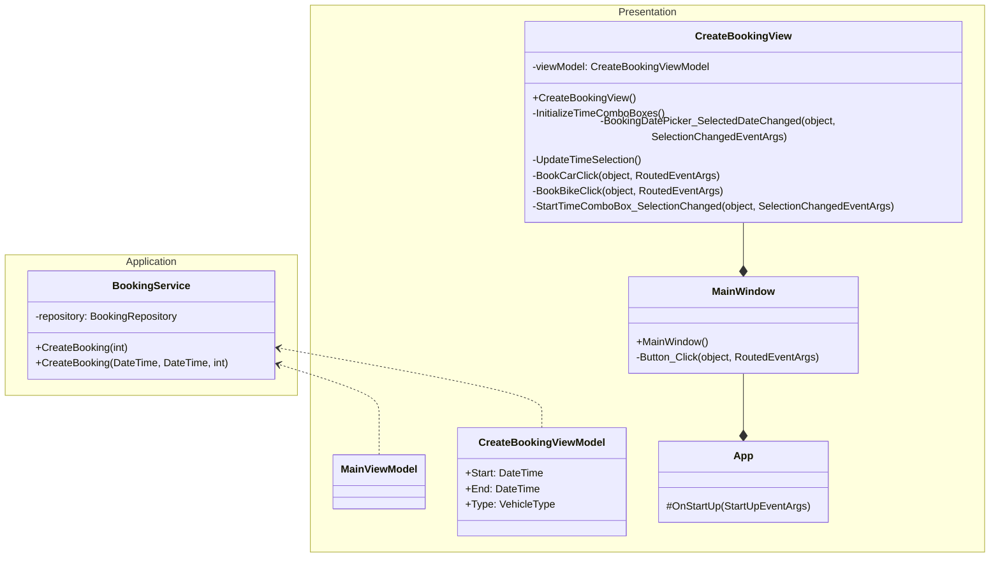

[[Arbejdsflow snak]]

---

```mermaid 
classDiagram  
direction BT
namespace Application{
class BookingService{
-repository: BookingRepository
+CreateBooking(int) 
+CreateBooking(DateTime, DateTime, int) 
}

}
namespace Presentation{
class MainWindow{
+MainWindow()
-Button_Click(object, RoutedEventArgs)
}
class CreateBookingView{
-viewModel: CreateBookingViewModel
+CreateBookingView()
-InitializeTimeComboBoxes()
-BookingDatePicker_SelectedDateChanged(object, SelectionChangedEventArgs)
-UpdateTimeSelection()
-BookCarClick(object, RoutedEventArgs)
-BookBikeClick(object, RoutedEventArgs)
-StartTimeComboBox_SelectionChanged(object, SelectionChangedEventArgs)
}
class CreateBookingViewModel{
+Start: DateTime
+End: DateTime
+Type: VehicleType 
}
class App{
#OnStartUp(StartUpEventArgs)
}
class MainViewModel
}


MainViewModel..>BookingService
CreateBookingViewModel ..> BookingService
App*--MainWindow
MainWindow*--CreateBookingView

```