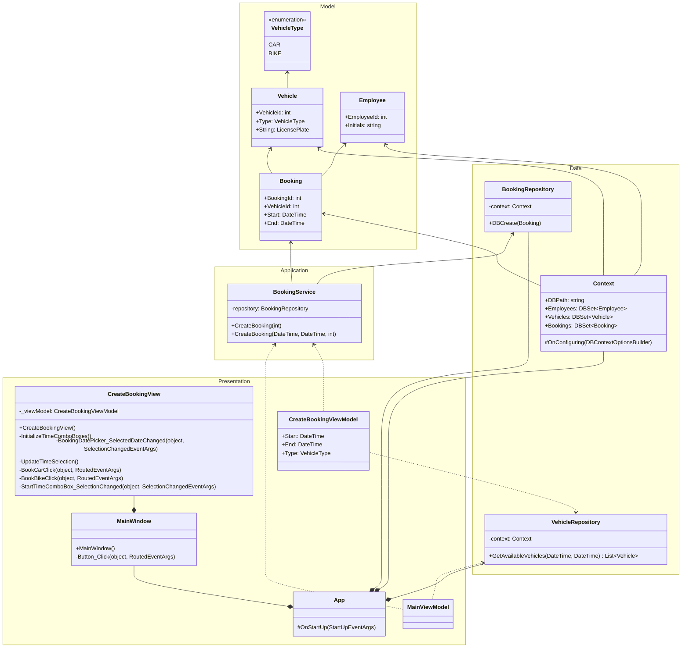

```mermaid 
classDiagram  
direction BT
namespace Model{
class VehicleType{
<<enumeration>>
CAR
BIKE
}
class Vehicle{
+Vehicleid: int
+Type: VehicleType
+String: LicensePlate
}
class Employee{
+EmployeeId: int
+Initials: string
}
class Booking{
+BookingId: int
+VehicleId: int
+Start: DateTime
+End: DateTime
}}
namespace Data{
class Context{
+DBPath: string
+Employees: DBSet~Employee~
+Vehicles: DBSet~Vehicle~
+Bookings: DBSet~Booking~ 
#OnConfiguring(DBContextOptionsBuilder)
}
class BookingRepository{
-context: Context 
+DBCreate(Booking) 
}
class VehicleRepository{
-context: Context 
+GetAvailableVehicles(DateTime, DateTime) List~Vehicle~
}}
namespace Application{
class BookingService{
-repository: BookingRepository
+CreateBooking(int) 
+CreateBooking(DateTime, DateTime, int) 
}

}

namespace Presentation{
class MainWindow{
+MainWindow()
-Button_Click(object, RoutedEventArgs)
}
class CreateBookingView{
-_viewModel: CreateBookingViewModel
+CreateBookingView()
-InitializeTimeComboBoxes()
-BookingDatePicker_SelectedDateChanged(object, SelectionChangedEventArgs)
-UpdateTimeSelection()
-BookCarClick(object, RoutedEventArgs)
-BookBikeClick(object, RoutedEventArgs)
-StartTimeComboBox_SelectionChanged(object, SelectionChangedEventArgs)
}
class CreateBookingViewModel{
+Start: DateTime
+End: DateTime
+Type: VehicleType 
}
class App{
#OnStartUp(StartUpEventArgs)
}
class MainViewModel
}

BookingService-->BookingRepository

BookingService-->Booking

Booking-->Vehicle
Booking-->Employee


VehicleRepository<..CreateBookingViewModel

MainViewModel..>VehicleRepository
MainViewModel..>BookingService
CreateBookingViewModel ..> BookingService
App*--BookingRepository 
App*--VehicleRepository
App*--MainWindow
App*--Context
MainWindow*--CreateBookingView

Context-->Employee
Context-->Vehicle
Context-->Booking


Vehicle-->VehicleType

```