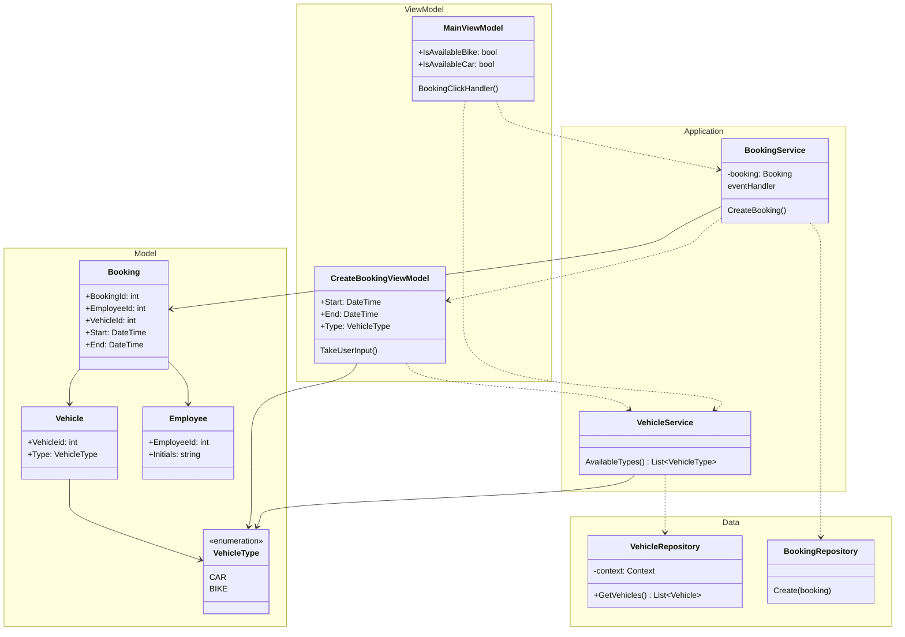

```mermaid 
classDiagram 
direction 
namespace Model{
class VehicleType{
<<enumeration>>
CAR
BIKE
}
class Vehicle{
+Vehicleid: int
+Type: VehicleType
}
class Employee{
+EmployeeId: int
+Initials: string
}
class Booking{
+BookingId: int
+EmployeeId: int
+VehicleId: int
+Start: DateTime
+End: DateTime
}}
namespace Data{
class VehicleRepository{
-context: Context
+GetVehicles() List~Vehicle~
}
class BookingRepository{
Create(booking) 
}}
namespace Application{
class BookingService{
-booking: Booking
eventHandler
CreateBooking() 
}
class VehicleService{
AvailableTypes() List~VehicleType~ 
}}

namespace ViewModel{
class CreateBookingViewModel{
+Start: DateTime
+End: DateTime
+Type: VehicleType 
TakeUserInput()
}
class MainViewModel{
+IsAvailableBike: bool
+IsAvailableCar: bool
BookingClickHandler()
}}

VehicleService..>VehicleRepository
BookingService..>BookingRepository

BookingService-->Booking

Booking-->Vehicle
Booking-->Employee

CreateBookingViewModel..>VehicleService

BookingService..>CreateBookingViewModel

MainViewModel..>BookingService

MainViewModel..>VehicleService

Vehicle-->VehicleType

CreateBookingViewModel-->VehicleType

VehicleService-->VehicleType
```