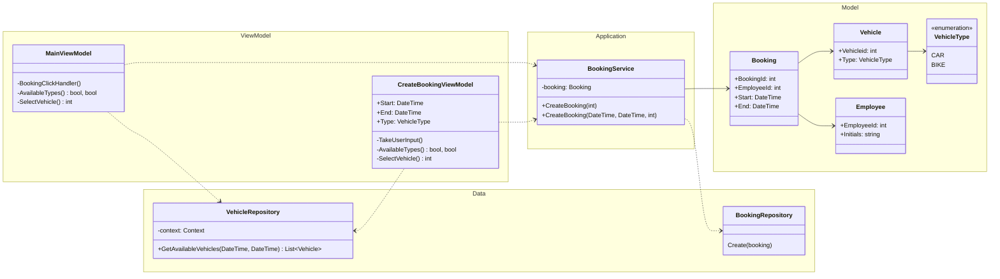

```mermaid 
classDiagram  
direction LR
namespace Model{
class VehicleType{
<<enumeration>>
CAR
BIKE
}
class Vehicle{
+Vehicleid: int
+Type: VehicleType
}
class Employee{
+EmployeeId: int
+Initials: string
}
class Booking{
+BookingId: int
+EmployeeId: int
%% +VehicleId: int
+Start: DateTime
+End: DateTime
}}
namespace Data{
class BookingRepository{
Create(booking) 
}
class VehicleRepository{
-context: Context
+GetAvailableVehicles(DateTime, DateTime) List~Vehicle~
}}
namespace Application{
class BookingService{
-booking: Booking
+CreateBooking(int) 
+CreateBooking(DateTime, DateTime, int) 
}

}

namespace ViewModel{
class CreateBookingViewModel{
+Start: DateTime
+End: DateTime
+Type: VehicleType 
-TakeUserInput()
-AvailableTypes() bool, bool
-SelectVehicle() int
}
class MainViewModel{

-BookingClickHandler()
-AvailableTypes() bool, bool
-SelectVehicle() int


}}

BookingService..>BookingRepository

BookingService-->Booking

Booking-->Vehicle
Booking-->Employee


VehicleRepository<..CreateBookingViewModel

MainViewModel..>VehicleRepository
MainViewModel..>BookingService
CreateBookingViewModel ..> BookingService


Vehicle-->VehicleType

```

