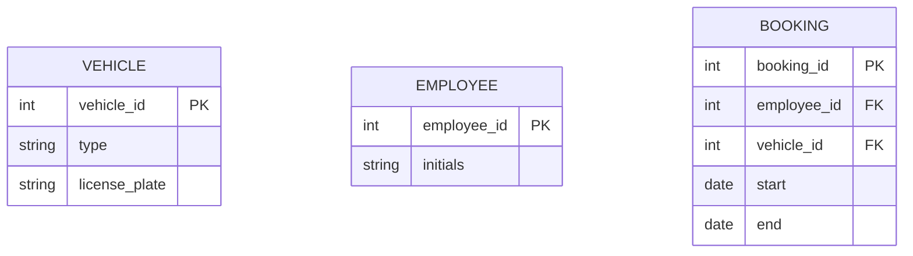

[[Refleksion om Logisk model af database]]
[[Logisk model version 2]]

---
Logisk model version 1

```mermaid
erDiagram
    VEHICLE{
    int vehicle_id PK
    string type 
    string license_plate
    }
    
    EMPLOYEE{
    int employee_id PK
    string initials  
    }
    
    BOOKING{
    int booking_id PK
    int employee_id FK
    int vehicle_id FK
    date start 
    date end
    }
    
    VEHICLE  
    EMPLOYEE
    BOOKING  
```