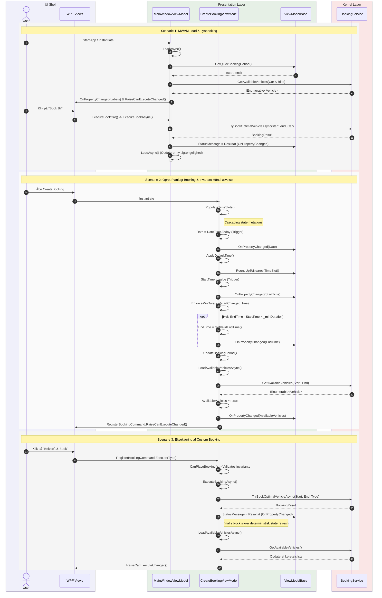

[[flow diagram]]

---

```mermaid
sequenceDiagram
    autonumber
    
    box rgb(240, 240, 250) UI Shell 
        actor User
        participant View as WPF Views
    end

    box rgb(230, 240, 230) Presentation Layer
        participant MWVM as MainWindowViewModel
        participant CBVM as CreateBookingViewModel
        participant VMB as ViewModelBase
    end

    box rgb(250, 230, 230) Kernel Layer
        participant BS as BookingService
    end

    %% SCENARIO 1: MainWindow & Lynbooking
    rect rgb(245, 245, 245)
        Note over User, BS: Scenarie 1: MWVM Load & Lynbooking
        User->>MWVM: Start App / Instantiate
        activate MWVM
        MWVM->>MWVM: LoadAsync()
        MWVM->>VMB: GetQuickBookingPeriod()
        VMB-->>MWVM: (start, end)
        MWVM->>BS: GetAvailableVehicles(Car & Bike)
        BS-->>MWVM: IEnumerable<Vehicle>
        MWVM->>View: OnPropertyChanged(Labels) & RaiseCanExecuteChanged()
        
        User->>View: Klik på "Book Bil"
        View->>MWVM: ExecuteBookCar() -> ExecuteBookAsync()
        MWVM->>BS: TryBookOptimalVehicleAsync(start, end, Car)
        BS-->>MWVM: BookingResult
        MWVM->>VMB: StatusMessage = Resultat (OnPropertyChanged)
        MWVM->>MWVM: LoadAsync() (Opdaterer ny tilgængelighed)
        deactivate MWVM
    end

    %% SCENARIO 2: CreateBooking Initialisering & Dato ændring
    rect rgb(250, 250, 250)
        Note over User, BS: Scenarie 2: Opret Planlagt Booking & Invariant Håndhævelse
        User->>View: Åbn CreateBooking
        View->>CBVM: Instantiate
        activate CBVM
        CBVM->>CBVM: PopulateTimeSlots()
        
        Note right of CBVM: Cascading state mutations
        CBVM->>CBVM: Date = DateTime.Today (Trigger)
        CBVM->>VMB: OnPropertyChanged(Date)
        CBVM->>CBVM: ApplyDefaultTime()
        CBVM->>VMB: RoundUpToNearestTimeSlot()
        
        CBVM->>CBVM: StartTime = value (Trigger)
        CBVM->>VMB: OnPropertyChanged(StartTime)
        CBVM->>CBVM: EnforceMinDuration(startChanged: true)
        
        opt Hvis EndTime - StartTime < _minDuration
            CBVM->>CBVM: EndTime = GetValidEndTime()
            CBVM->>VMB: OnPropertyChanged(EndTime)
        end
        
        CBVM->>CBVM: UpdateBookingPeriod()
        CBVM->>CBVM: LoadAvailableVehiclesAsync()
        CBVM->>BS: GetAvailableVehicles(Start, End)
        BS-->>CBVM: IEnumerable<Vehicle>
        CBVM->>CBVM: AvailableVehicles = result
        CBVM->>VMB: OnPropertyChanged(AvailableVehicles)
        CBVM->>View: RegisterBookingCommand.RaiseCanExecuteChanged()
    end

    %% SCENARIO 3: Custom Booking Execution
    rect rgb(245, 245, 245)
        Note over User, BS: Scenarie 3: Eksekvering af Custom Booking
        User->>View: Klik på "Bekræft & Book"
        View->>CBVM: RegisterBookingCommand.Execute(Type)
        CBVM->>CBVM: CanPlaceBooking() -> Validates invariants
        CBVM->>CBVM: ExecuteBookingAsync()
        CBVM->>BS: TryBookOptimalVehicleAsync(Start, End, Type)
        BS-->>CBVM: BookingResult
        CBVM->>VMB: StatusMessage = Resultat (OnPropertyChanged)
        
        Note right of CBVM: finally block sikrer deterministisk state refresh
        CBVM->>CBVM: LoadAvailableVehiclesAsync()
        CBVM->>BS: GetAvailableVehicles()
        BS-->>CBVM: Opdateret køretøjsliste
        CBVM->>View: RaiseCanExecuteChanged()
        deactivate CBVM
    end
```