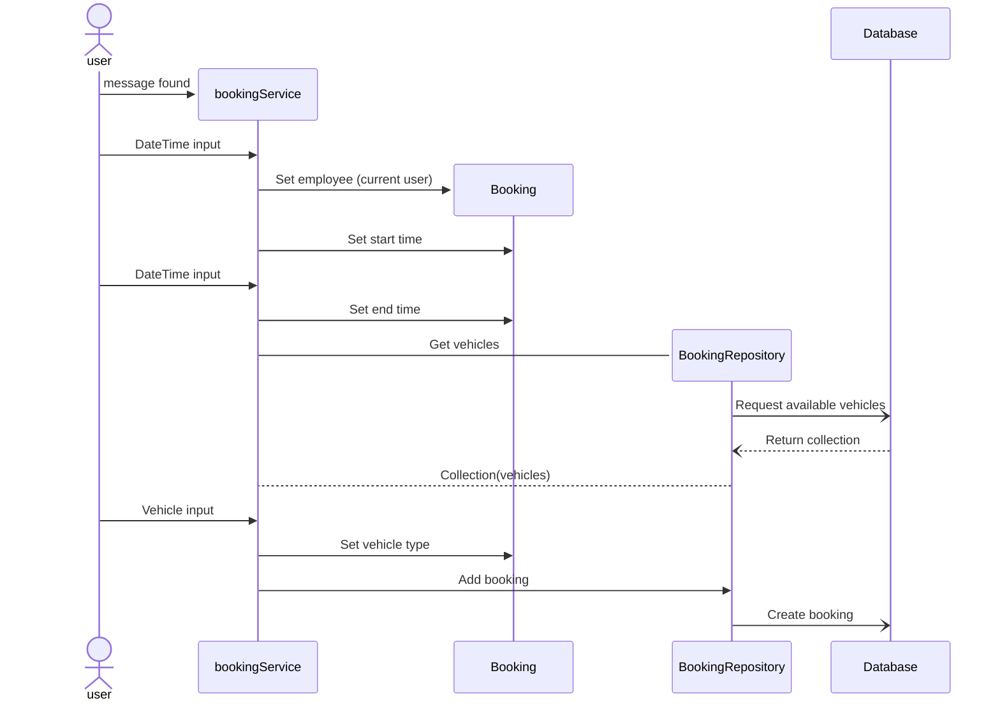

---
created: 2026-05-18
section: elaboration 2
exclude: false
sortKey: 12.41517
---

baseret på Use case - opret booking

```mermaid
sequenceDiagram

actor A as user

create participant B as bookingService 
A ->> B: message found  
A ->> B: DateTime input
create participant C as Booking
B ->> C: Set employee (current user)
B ->> C: Set start time
A ->> B: DateTime input
B ->> C: Set end time
create participant D as BookingRepository
B -> D: Get vehicles

D -) DB: Request available vehicles
DB --) D: Return collection
D --> B: Collection(vehicles)
A ->> B: Vehicle input
B ->> C: Set vehicle type
B ->> D: Add booking

participant DB as Database

D -) DB: Create booking

```

