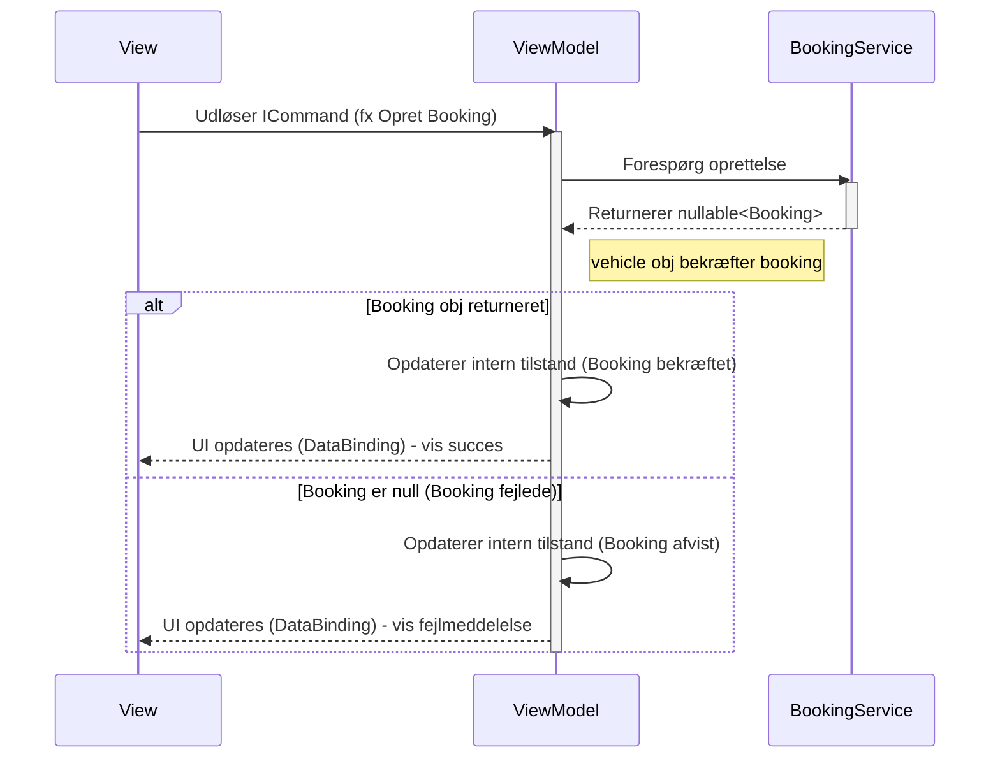

[[Sekvens over View-Viewmodel interaktioner]]

---

```mermaid
sequenceDiagram
    participant V as View
    participant VM as ViewModel
    participant BS as BookingService

    V->>VM: Udløser ICommand (fx Opret Booking)
    activate VM
    VM->>BS: Forespørg oprettelse
    activate BS
    BS -->> VM: Returnerer nullable<Booking> 
    deactivate BS
    Note left of BS: vehicle obj bekræfter booking
    
    alt Booking obj returneret
        VM->>VM: Opdaterer intern tilstand (Booking bekræftet)
        VM-->>V: UI opdateres (DataBinding) - vis succes
    else Booking er null (Booking fejlede)
        VM->>VM: Opdaterer intern tilstand (Booking afvist)
        VM-->>V: UI opdateres (DataBinding) - vis fejlmeddelelse
    end
    deactivate VM
```