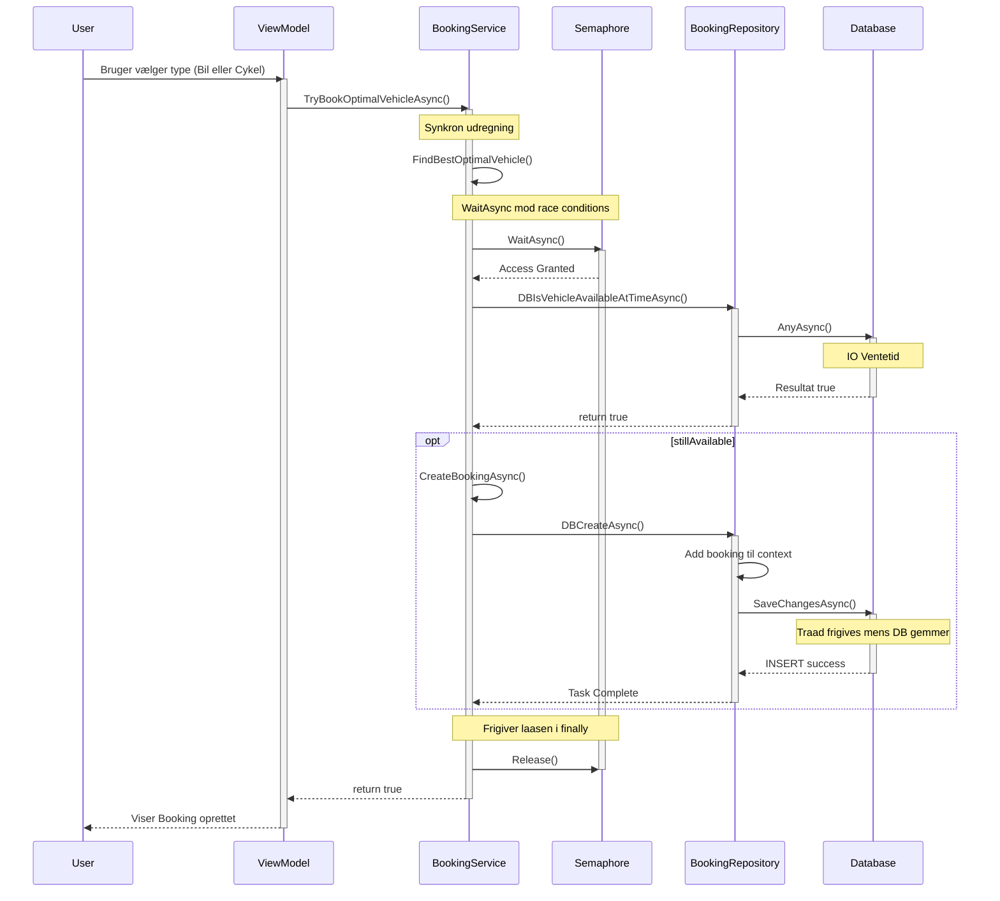

```mermaid
sequenceDiagram
    participant User
    participant ViewModel
    participant BookingService
    participant Semaphore
    participant BookingRepository
    participant Database

    User->>ViewModel: Bruger vælger type (Bil eller Cykel)
    activate ViewModel
    
    ViewModel->>BookingService: TryBookOptimalVehicleAsync()
    activate BookingService
    
    Note over BookingService: Synkron udregning
    BookingService->>BookingService: FindBestOptimalVehicle()

    Note over BookingService,Semaphore: WaitAsync mod race conditions
    BookingService->>Semaphore: WaitAsync()
    activate Semaphore
    Semaphore-->>BookingService: Access Granted
    
    BookingService->>BookingRepository: DBIsVehicleAvailableAtTimeAsync()
    activate BookingRepository
    
    BookingRepository->>Database: AnyAsync()
    activate Database
    Note over Database: IO Ventetid
    Database-->>BookingRepository: Resultat true
    deactivate Database
    
    BookingRepository-->>BookingService: return true
    deactivate BookingRepository
    
    opt stillAvailable
        BookingService->>BookingService: CreateBookingAsync()
        
        BookingService->>BookingRepository: DBCreateAsync()
        activate BookingRepository
        
        BookingRepository->>BookingRepository: Add booking til context
        
        BookingRepository->>Database: SaveChangesAsync()
        activate Database
        Note over Database: Traad frigives mens DB gemmer
        Database-->>BookingRepository: INSERT success
        deactivate Database
        
        BookingRepository-->>BookingService: Task Complete
        deactivate BookingRepository
    end

    Note over BookingService,Semaphore: Frigiver laasen i finally
    BookingService->>Semaphore: Release()
    deactivate Semaphore
    
    BookingService-->>ViewModel: return true
    deactivate BookingService
    ViewModel-->>User: Viser Booking oprettet
    deactivate ViewModel
```
 
