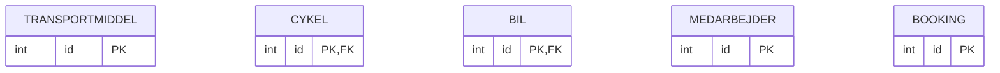

[[Forløbig plan]]
[[For at kunne modellere databasen skal vi have styr på vores forretningsregler]]

# Entiteter
- Transportmidler
	- Cykler
	- Biler
- Pædagoger
- Leder
- Flådestyring
- Borgere
- Booking
- Bookingsystem
- Bopæl
- Bosted
- Bookingstatus
- Borgerliste
- Booking tidsgrænse 
- Påmindelser om 
- sms til borger 

Vi er blevet enige om, at vi kan gå videre til logisk model i modelleringen af database - vi har domæneviden nok

