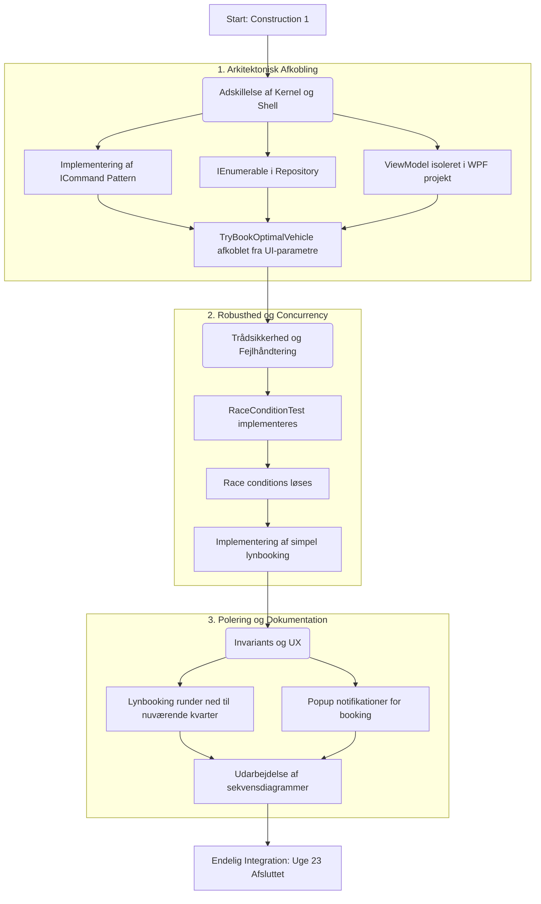

[[construction kronologi]]

---

```mermaid
graph TD
    %% Faser
    Start[Start: Construction 1] --> Afkobling
    
    subgraph 1. Arkitektonisk Afkobling
    Afkobling(Adskillelse af Kernel og Shell)
    Afkobling --> ICommand[Implementering af ICommand Pattern]
    Afkobling --> Repo[IEnumerable<Vehicle> i Repository]
    Afkobling --> ViewModel[ViewModel isoleret i WPF projekt]
    ICommand --> UIAfkobling[TryBookOptimalVehicle afkoblet fra UI-parametre]
    Repo --> UIAfkobling
    ViewModel --> UIAfkobling
    end

    UIAfkobling --> Concurrency

    subgraph 2. Robusthed og Concurrency
    Concurrency(Trådsikkerhed og Fejlhåndtering)
    Concurrency --> RaceTest[RaceConditionTest implementeres]
    RaceTest --> RaceFix[Race conditions løses]
    RaceFix --> Lynbooking[Implementering af simpel lynbooking]
    end

    Lynbooking --> Polering

    subgraph 3. Polering og Dokumentation
    Polering(Invariants og UX)
    Polering --> Kvarter[Lynbooking runder ned til nuværende kvarter]
    Polering --> Notifikation[Popup notifikationer for booking]
    Kvarter --> Sekvens[Udarbejdelse af sekvensdiagrammer]
    Notifikation --> Sekvens
    end

    Sekvens --> Slut[Endelig Integration: Uge 23 Afsluttet]
```